# Human Activity Prediction using Sensor Fusion

## Introduction

This project aims to predict human activities using sensor data collected from individuals. By leveraging various machine learning algorithms, the collected data is processed and analyzed to accurately classify different activities. The project demonstrates the potential of sensor fusion in recognizing and predicting human activities, with applications ranging from smart wearables to health monitoring systems.

## Usage and Data Preparation

To utilize this project, follow these steps:

1. **Download the PAMAP2 Dataset**: Obtain the PAMAP2 Dataset from [here](https://archive.ics.uci.edu/ml/datasets/PAMAP2+Physical+Activity+Monitoring).

2. **Download Preprocessed Data**: Download the preprocessed `PAMAP2_data.csv` file from the [OneDrive Link](https://iiitaphyd-my.sharepoint.com/:f:/g/personal/divyansh_t_research_iiit_ac_in/EhHLy69jD4xHqiqZc_FZlrIBl9JDPdDgHOvXD7y1HzbF6A?e=YOjACc). Place the `PAMAP2_data.csv` file in the `root/src` directory, alongside the `Project_Trees.ipynb` and `Project_NN.ipynb` notebooks.

3. **Preprocessing**: Run the `main.py` file in the root directory using the following command:
   ```python
   python main.py

   ```

   This will generate the `PAMAP2_data.csv` file in the `root/src` directory.

4. **Run the Notebooks**: The notebooks for Logistic Regression, Decision Trees, Support Vector Machine (SVM), and Neural Network are located in the src directory. These can be executed directly to explore and compare different machine learning algorithms.

# Presentation Slides

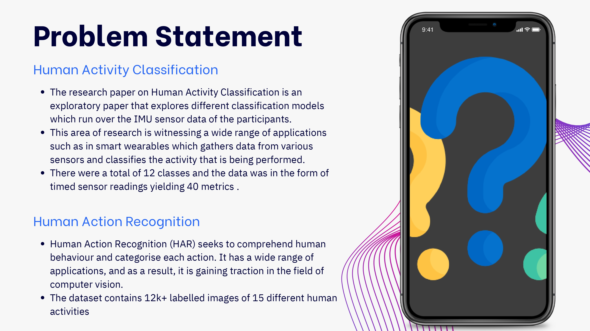
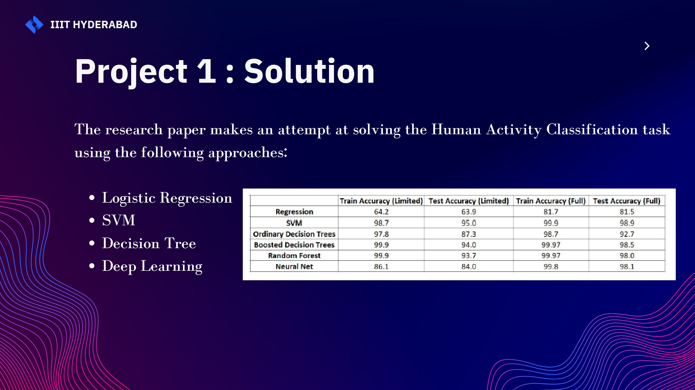
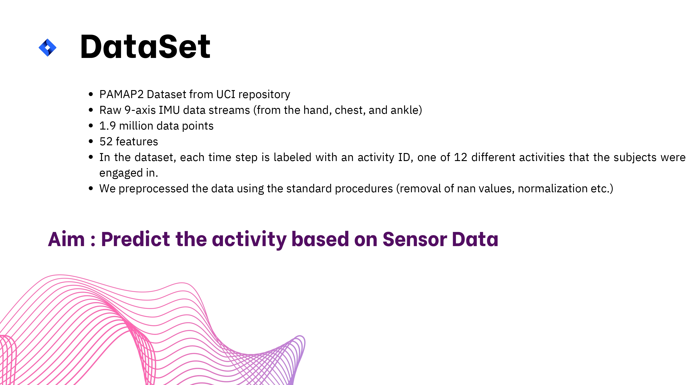
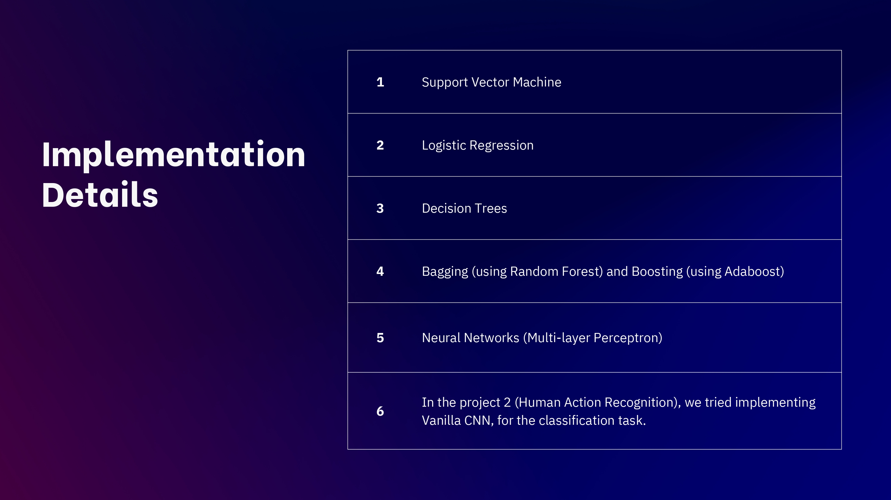
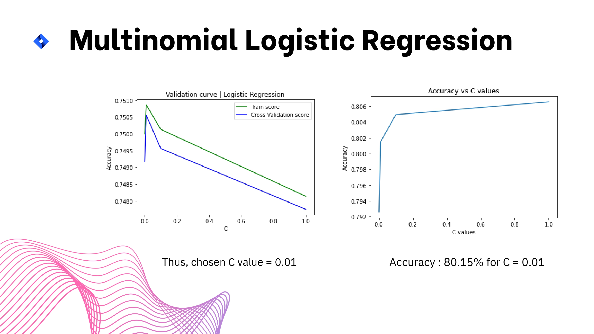
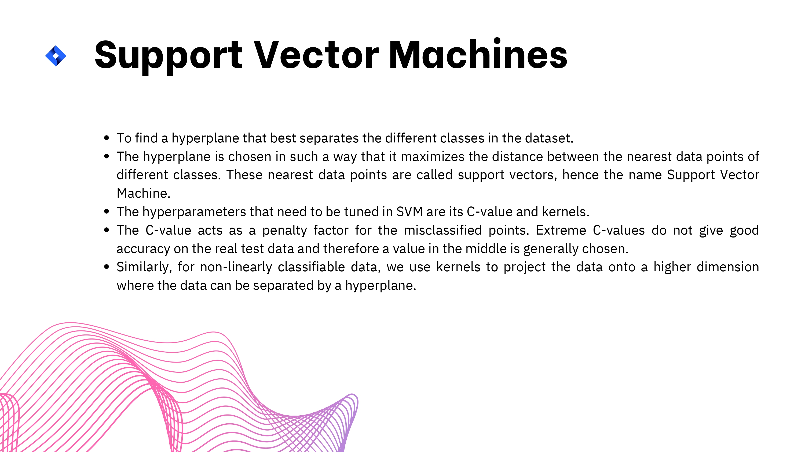
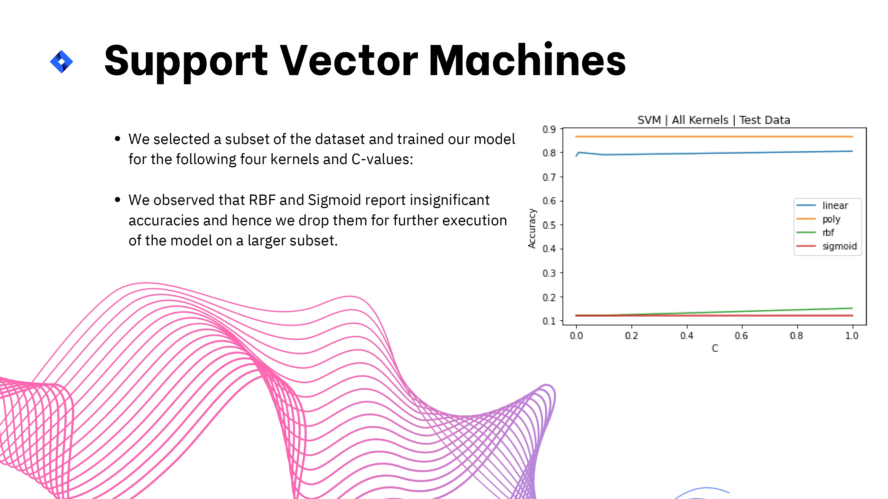
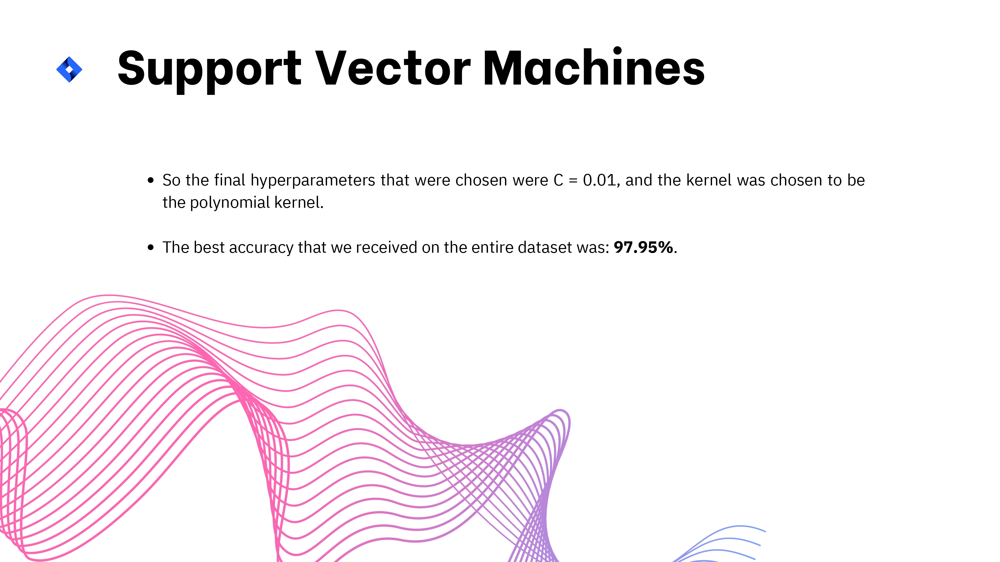
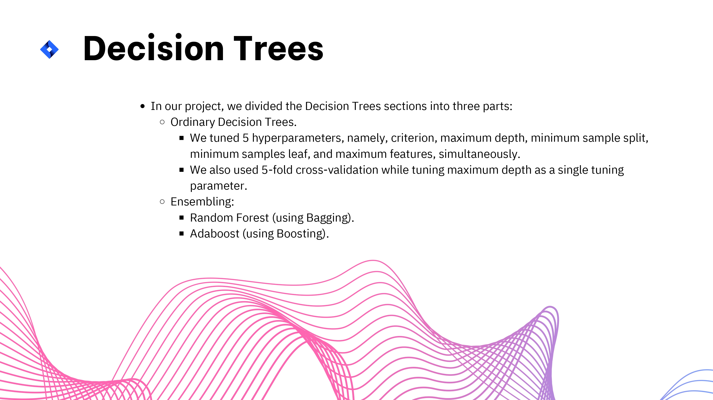
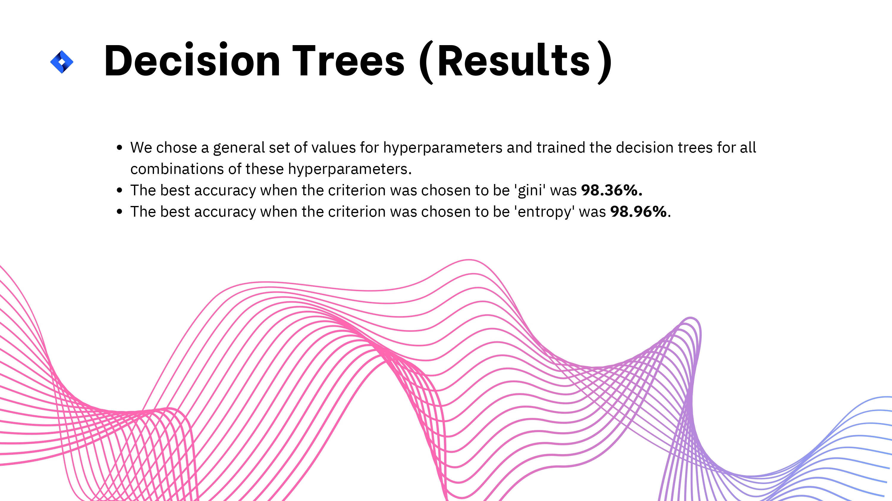
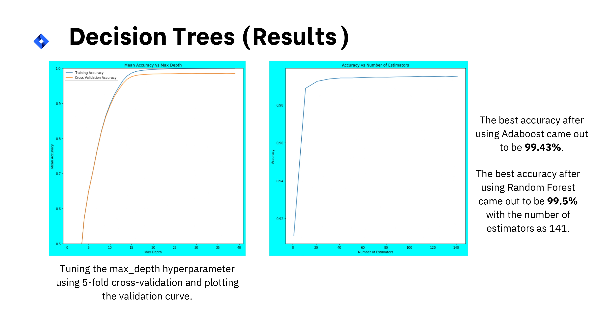
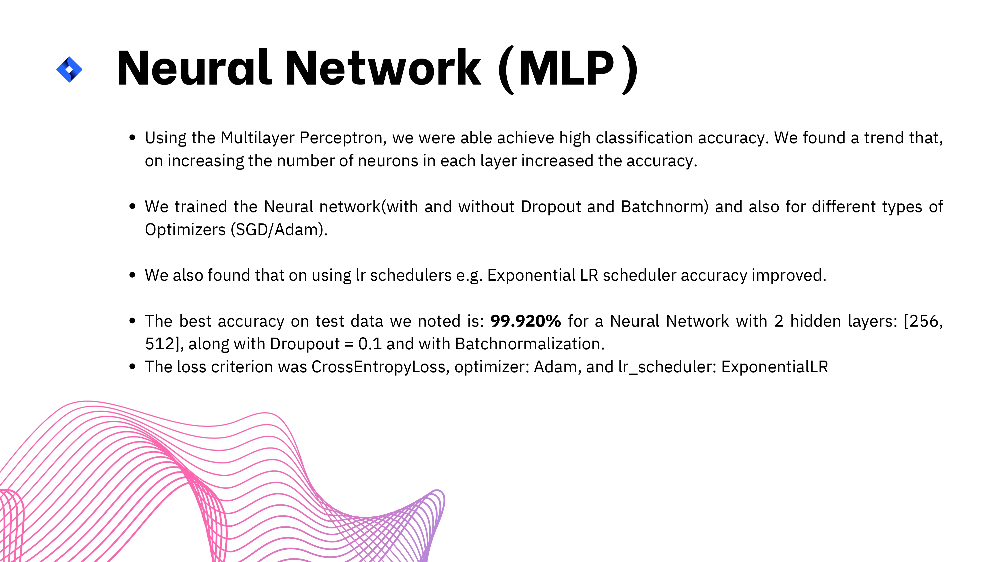
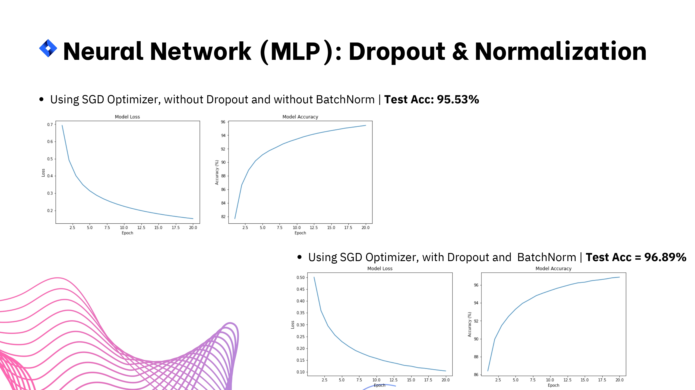
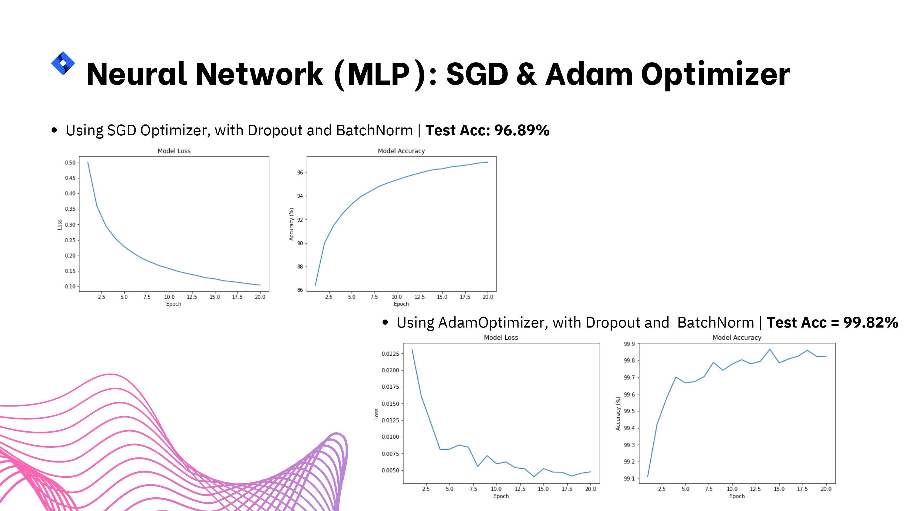
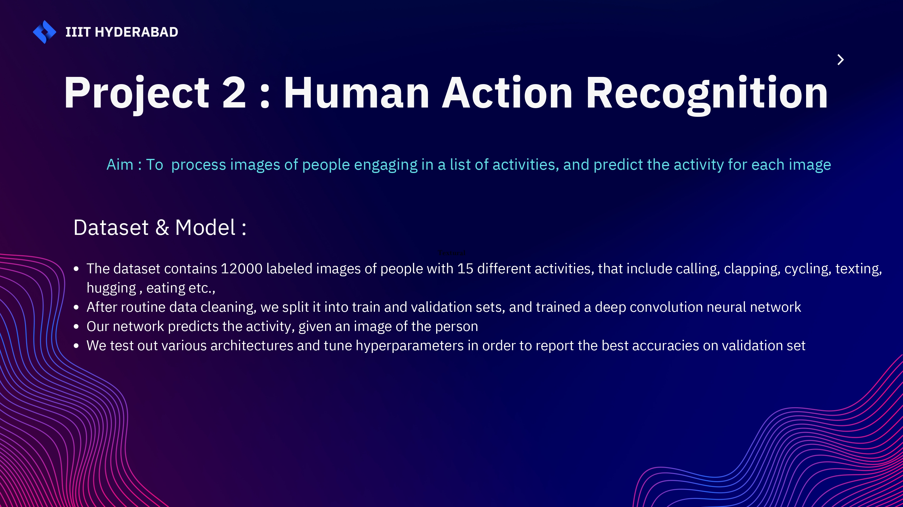
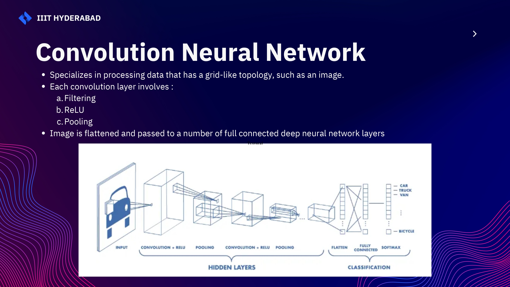

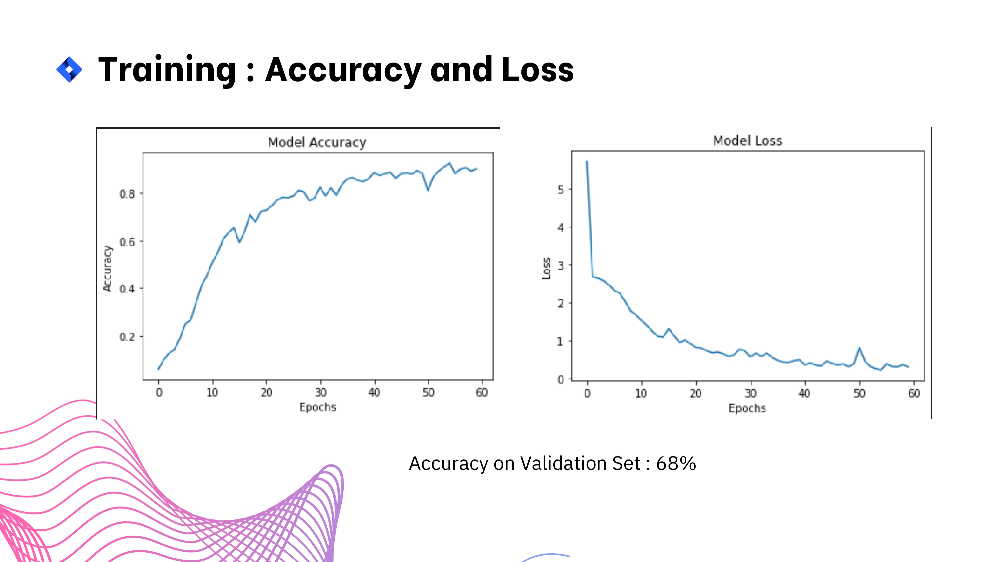
